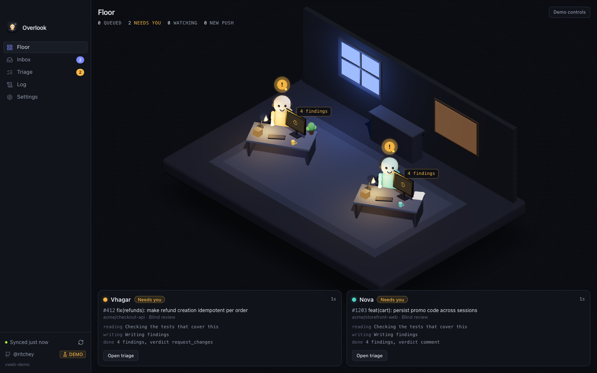
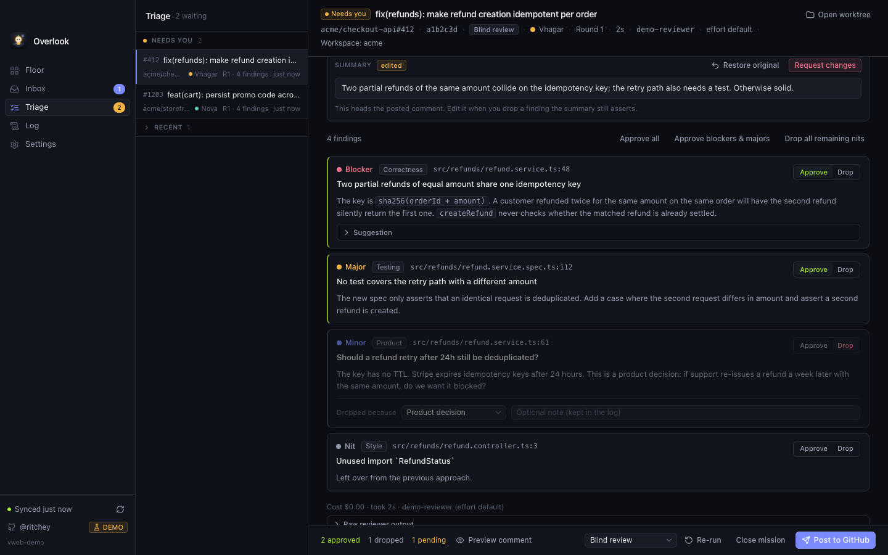

# Overlook

[](https://github.com/Ritcheyy/overlook-ai/actions/workflows/ci.yml)  

A macOS desktop app that reviews your GitHub pull requests with Claude Code, shows the reviewers as characters on a small 3D floor, and stops before posting so you decide what the author sees.



## What it does

- **Inbox.** Pull requests where your review is requested (and your own, for self-review) arrive from GitHub. One click sends a PR to the floor with a chosen review style.
- **Floor.** A character checks the PR out into an isolated git worktree and runs Claude Code on it. The character's animation is the real state: preparing, reading, thinking, writing, waiting for you, failed. Queued PRs sit on a shelf; PRs being watched for pushes hang on the corkboard.
- **Briefing.** Every review comes back with a short plain-language explanation of the PR, so you know what was done and why without reading the diff. It is for you, never posted.
- **Triage.** Findings are cards with severity, category and a file link. Approve or drop each one (product decision, false positive, already known, not worth it), edit the summary, preview, and post one comment. Or let a repo auto-post.
- **Follow-ups.** When the author pushes, the same character reviews only the delta. Automatic follow-ups are capped so an active author cannot burn your budget unattended.
- **Workspaces.** Products split across repos are reviewed with the sibling repos in view: the reviewer can read them, check their open PRs, and use the notes you keep for the workspace. Cross-repo findings name the PR they depend on.



## How it works

Reviews run locally. The app polls GitHub through the `gh` CLI you are already logged in with, creates a worktree for each PR next to your own checkout, and spawns `claude -p` inside it with a read-only tool allow-list, a structured-output schema and a per-review budget. The PR branch's own `.claude/` settings and MCP config are ignored, so a pull request cannot hand the reviewer tools. Comments are posted with your `gh` login. Nothing leaves the machine except what Claude Code and `gh` already send.

Demo mode is on by default: a fake GitHub and a scripted reviewer drive the whole app, so you can try everything without a login or a token.

## Status

Overlook is a personal tool I use every day, shared as it is. It runs on macOS, needs Claude Code and the GitHub CLI, and you build it yourself; there are no packaged releases or auto-updates yet. Issues and ideas are welcome, and I'll respond when I can, but it's maintained around my own workflow rather than a roadmap. If it fits yours too, fork away.

## Requirements

- macOS on Apple silicon (the engine and UI are portable; packaging and the Electron tests are macOS-only for now)
- Node 22 and pnpm
- For real reviews: [GitHub CLI](https://cli.github.com) logged in, and the [Claude Code CLI](https://docs.anthropic.com/en/docs/claude-code) on your machine

Reviews spend your Claude Code usage. The per-review budget caps how much work one review may do; on a subscription it is a size limit, not a bill.

## Quick start

```bash
pnpm install
pnpm dev          # Electron app with hot reload, demo mode
pnpm dev:web      # the UI alone in a browser tab, demo engine in-process
```

To review real PRs: Settings > General, turn Demo mode off and press Restart now; Settings > Claude, press Check environment until every row is green; Settings > Repositories, switch off the repos you do not care about. Then send a small PR from the Inbox. `docs/operations.md` has the full checklist and a troubleshooting table.

## Install as an app

```bash
pnpm release      # builds, packages, installs and signs /Applications/Overlook.app
```

There is no auto-updater yet; run `pnpm release` again after pulling changes. Settings and history live in `~/Library/Application Support/Overlook` and survive reinstalls.

## Configuration, briefly

- **Loadouts** are review styles: Blind review, Security pass, Product eye, or your own. Each is a prompt appended to the review instructions. A loadout can instead send a custom message that invokes a Claude Code skill by name; see `docs/operations.md` before using that.
- **Models.** Pick `fable`, `opus` or `sonnet` (the CLI resolves each to the latest of that family), a full model id, or the CLI default, plus a fallback model for when the main one is overloaded. Each round records what actually ran.
- **Auto-post** per repo skips the triage stop. **Automatic follow-up rounds** (default 0) sets how many times a mission re-reviews on its own after pushes.
- **Signature** is a template: `{loadout} · Reviewed by {character} · {approval}` by default, where `{approval}` names you or says "Posted automatically".
- **Workspaces** are detected from a folder that holds several repos and start on when that folder has its own `CLAUDE.md`; you can also group repos by hand.

## Development

```bash
pnpm typecheck && pnpm test          # TypeScript projects and vitest
pnpm build:web && pnpm e2e:web       # playwright, browser build, demo engine
pnpm build && pnpm e2e:electron      # playwright, packaged main process, demo mode
```

- `docs/architecture.md` — how the engine, the Electron shell and the UI fit together
- `docs/operations.md` — real mode, packaging, troubleshooting
- `CONTRIBUTING.md` — conventions and how to add things
- `SECURITY.md` — what the app touches and what a hostile PR can do

Layout: `src/core` is the browser-safe engine with a fake for every port; `src/main` is the Electron main process and the real adapters; `src/preload` is the typed bridge; `src/renderer` is the React UI.

## License

MIT. See `LICENSE`.
